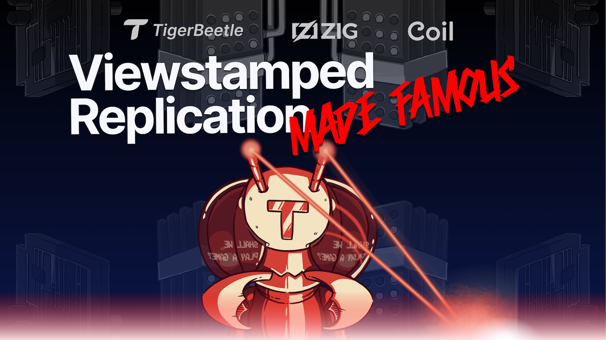

# Viewstamped Replication Made Famous
## A $20,000 Consensus Challenge
*Brought to you by [Coil](https://www.coil.com) in partnership with our friends at the [Zig Software Foundation (ZSF)](https://ziglang.org).*

> Do you love distributed systems, high availability and fault tolerance? Do network partitions and consensus protocols scare you? Have you watched War Games, Hackers and Sneakers more than once? Ever wanted to be a bounty hunter but didn't know where to start?

If you answered **Yes!!!** to any of the above, then this is your invitation to test *our skills* and **learn consensus the fun way**, by hacking [TigerBeetle](https://www.tigerbeetle.com)'s biodigital jazz version of the pioneering Viewstamped Replication consensus protocol, and earning bounties of **up to $3,000 for a correctness bug** and **up to $500 for a liveness bug**, within scope, in a $20,000 consensus challenge.

**[Watch the launch event on Zig SHOWTIME for an introduction to the protocol and behind-the-scenes interviews with Dr Brian M. Oki and Dr James Cowling.](https://www.youtube.com/watch?v=_Jlikdtm4OA)**

## Shall we play a game?

* [Who can participate?](#who-can-participate)
* [How long will the challenge run?](#how-long-will-the-challenge-run)
* [What is the scope?](#what-is-the-scope)
* [What is a correctness bug?](#what-is-a-correctness-bug)
* [What is a liveness bug?](#what-is-a-liveness-bug)
* [What is the network fault model?](#what-is-the-network-fault-model)
* [What is the storage fault model?](#what-is-the-storage-fault-model)
* [What is the clock fault model?](#what-is-the-clock-fault-model)
* [What is the process fault model?](#what-is-the-process-fault-model)
* [What are the bounty awards?](#what-are-the-bounty-awards)
* [How do I submit a bug?](#how-do-i-submit-a-bug)
* [How will submissions be assessed?](#how-will-submissions-be-assessed)
* [How will bounty awards be paid?](#how-will-bounty-awards-be-paid)
* [How will this benefit the Zig Software Foundation?](#how-will-this-benefit-the-zig-software-foundation-zsf)
* [How can I run the implementation? How many batteries are included? Do you mean I can even run the VOPR?](#how-can-i-run-the-implementation-how-many-batteries-are-included-do-you-mean-i-can-even-run-the-vopr)
* [How can I maximize my probability of an epic hack?](#how-can-i-maximize-my-probability-of-an-epic-hack)
* [Can I be awesome and make Viewstamped Replication famous?](#can-i-be-awesome-and-make-viewstamped-replication-famous)
* [FAQ](#faq)
* [Thanks](#thanks)
* [The legal stuff](#the-legal-stuff)

## Who can participate?

* Anyone, at any skill level, is welcome! 
* You can join as an individual, or as a team for maximum fun.
* However, you must not be an employee or contractor of Coil or any Coil subsidiary.
* You must also not be a resident of, or make submissions from, a country against which the United States has issued export sanctions or other trade restrictions.

## How long will the challenge run?

The challenge will run from 6pm UTC on September 11, 2021 **until 6pm UTC on December 11, 2021, or until the total challenge bounty of $20,000 is fully awarded**, whichever comes first.

## What is the scope? 

The scope of the challenge and any bounty award is:

* **Limited to non-Byzantine correctness bugs and liveness bugs** as defined below, **within this specific implementation** of Viewstamped Replication (VSR) in this GitHub repo.
* **Limited to our VSR protocol as implemented in code within the `src/vsr` directory**, not as specified in the original papers. We want to test the version of the VSR protocol that we run.
* **Limited to our network, storage, clock and process fault models** as defined below.

Furthermore, to be clear, the scope:

* **Excludes the reconfiguration protocol** as specified in the *Viewstamped Replication Revisited* paper.
* **Excludes any snapshot protocol** as specified in the *Viewstamped Replication Revisited* or *Protocol-Aware Recovery for Consensus-Based Storage* papers, which is a work-in-progress for TigerBeetle. The implementation here provides a fixed-size log limited to a fixed number of entries, and exceeding this log is beyond the scope of the challenge.
* **Excludes the Recovery Protocol at replica startup** just for the next few days, as we plan to have this completed soon (along with crash fault injection in the VOPR).
* **Excludes data scrubbing** as this is a work-in-progress for TigerBeetle.
* **Excludes all other codebases outside this repo, such as the main TigerBeetle repo**. We have forked the precise implementation to be used here for the purpose of this challenge to provide a generic "batteries-included" implementation that anyone can run.
* **Excludes Byzantine faults**, for example, where the operators of servers and clients are malicious.
* **Excludes any kind of security issue**, for example, the possibility for a "man-in-the-middle" or a distributed denial of service attack, because this is **a consensus bug bounty challenge not a security bug bounty program**.
* **Excludes any duplicate reports** that have already been submitted.
* **Excludes any known issues related to TODOs** as already documented in the implementation.
* **Excludes bugs in any test code** within this repository.
* **Excludes any fixes to the implementation** that have already fixed an issue that is subsequently reported.

Only correctness and liveness bugs, at our sole discretion, may be awarded.

### What is a correctness bug?

A correctness bug is a bug in this specific implementation that **causes the consistency guarantee of strict serializability to be violated or results in data loss**, and that could have been averted had the protocol been correctly implemented.

* The **combined hardware failure across a majority of servers is explicitly out of scope** for a correctness bug, even though this might result in data loss, because the protocol is expressly designed to tolerate only a minority of server failures.
* Any *potential* correctness bug that is nevertheless detected by TigerBeetle through **an assertion that results only in a crash is explicitly out of scope** for a correctness bug, and may be considered as a liveness bug only.
* Anything that does not violate strict serializability or does not ultimately result in data loss is explicitly out of scope for a correctness bug.

Again, what constitutes a correctness bug for the purpose of this challenge will remain at our sole discretion.

### What is a liveness bug?

A liveness bug is where this specific implementation achieves less availability (for example, because of a crash, or by getting stuck) than should be possible for the Viewstamped Replication Revisited version of the protocol, given the same network conditions, which must allow for a majority of servers (for example, 2 out of 3 servers, or 3 out of 5 servers) to communicate with each other and with clients.

* The **[famous FLP impossibility result](https://en.wikipedia.org/wiki/Consensus_(computer_science)#The_FLP_impossibility_result_for_asynchronous_deterministic_consensus) is explicitly out of scope** for a liveness bug, because we require liveness only to the extent that it is actually possible, not when communication (and thus liveness) is impossible.
* Any **unavailability during a view change is explicitly out of scope** for a liveness bug, provided that the view change eventually terminates and performs as well as a correct implementation of the protocol would permit.
* The **[Raft liveness bug](https://decentralizedthoughts.github.io/2020-12-12-raft-liveness-full-omission/) [experienced by Cloudflare as a 6-hour production outage](https://blog.cloudflare.com/a-byzantine-failure-in-the-real-world/) is explicitly out of scope** for a liveness bug, only because this is a known issue and something for which we already have a solution in the works for TigerBeetle.
* A bug that causes a replica to crash in the background, and that leaves the rest of the cluster available, may nevertheless be considered a liveness bug, since it diminishes total write availability, even while it may go unnoticed by the client.
 
There is a fine line between an optimization bug and a liveness bug. Again, what constitutes a liveness bug for the purpose of this challenge will remain at our sole discretion.

## What is the network fault model?

Messages between servers and clients may be:

* dropped,
* delayed,
* replayed,
* reordered,
* corrupted, and/or
* routed to the wrong address.

## What is the storage fault model?

I/O operations to and from disk may be:

* corrupted,
* misdirected to the wrong sector,
* rendered impossible because of a latent sector error,
* no-ops, performing no actual I/O while at the same time reporting success.

Furthermore:

* **Corruption does not always imply a system crash.** Data may be corrupted at any time during its storage lifecycle: before being written, while being written, after being written, and while being read.
* **Disk sector writes are not atomic.** For example, an Advanced Format 4096 byte sector write to a disk with an emulated logical sector size of 4096 bytes but a physical sector size of 512 bytes is not atomic, and would be split into 8 physical sector writes, which may or may not be atomic.
* The Linux **kernel page cache is not always reliable and may misrepresent the state of data on disk** after an EIO or latent sector error. See [Can Applications Recover from fsync Failures?](https://www.usenix.org/system/files/atc20-rebello.pdf) from the University of Wisconsin–Madison presented at the 2020 USENIX Annual Technical Conference.
* **File system metadata (such as the size of a file stored in the inode) is not always reliable and may change at any time.**
* However, **memory faults are explicitly out of scope.**

*Pssstt!! Are you excited about the prospect of hacking a consensus protocol with a realistic storage fault model?*

## What is the clock fault model?

*N.B. TigerBeetle does not depend on any clock synchronization at all for correctness and does not rely on leader leases, which are dangerous.*

TigerBeetle's implementation does include a clock fault failure detector that piggybacks on the consensus protocol, but this is only for defense-in-depth to shutdown safely, if the leader needs to timestamp transactions in a batch ahead of preparing and replicating the batch through the consensus protocol, but where the clock synchronization service such as NTP or PTP is unavailable because of an *unaligned* network partition, and where this *unaligned* network partition leaves a majority of TigerBeetle replicas available.

You can [read more about our clock fault failure detector](https://www.tigerbeetle.com/post/three-clocks-are-better-than-one) on our website. It's important to note that it is designed to be *complementary* to any clock synchronization service that the operator may run, because it's never enough to *trust* that the clock synchronization service is running, we also need to *verify* that it is.

Any **unavailability due to excessive clock skew beyond our clock fault failure detector's tolerance for clock error is explicitly out of scope for a liveness bug**, only because this is a safety mode available to operators of TigerBeetle who require accurate timestamps for their particular domain.

Clocks may:

* skew relative to each other and have **significantly different wall clock (i.e. wristwatch) readings across servers.**
* **jump forwards or backwards in time at any time** so that clock skew may also change quickly by a very large amount, for example, if a system administrator were to set the year on a server accidentally ahead to 2051.
* **gradually drift and have their ticking frequencies speed up or slow down, but not so much so quickly** that the Linux kernel's monotonic `CLOCK_BOOTTIME` time source cannot be used as a fairly reliable stopwatch to measure elapsed time accurate to a few milliseconds within a short 2-minute window.

*Tip: Since TigerBeetle's implementation of VSR does not depend on clocks for correctness, the clock fault model is more likely to produce liveness bugs than correctness bugs.*

## What is the process fault model?

A process may:

* **crash at any time.**
* **freeze process execution** for minutes or hours at a time, for example during a VM migration, but this will not affect the Linux kernel's monotonic `CLOCK_BOOTTIME` time source.

## What are the bounty awards?

The total value of the bounty is $20,000, to be awarded across correctness or liveness bugs within scope as follows:

| **Bug** | **Bounty** |
| :--- |:---|
| Correctness | $1,000 - $3,000 |
| Liveness | $250 - $500 |

* **Bounty payouts and amount, if any, will be determined by us at our sole discretion.** In no event are we obligated to provide a payout for any submission.
* To be eligible, the issue must be submitted after 6pm UTC on September 11, 2021, and after the publication of this specific implementation, and before 6pm UTC on December 11, 2021 or before the total value of the bounty is exhausted, whichever comes first.
* Previous bounty amounts will not be considered a precedent for future bounty amounts.
* The format, currency and timing of all bounty payouts shall be determined by us at our sole discretion.
* **You are solely responsible for any transaction fees and tax implications** related to any bounty payouts you may receive.

## How do I submit a bug?

1. Check that your submission is **[within the scope of the challenge](#what-is-the-scope)**.
2. Check the GitHub issues to **ensure that your report is unique** (duplicate submissions will not be awarded).
3. **Open a new Github issue** and choose the appropriate *Correctness* or *Liveness* template for your submission. The template will guide you on what to include and will add the appropriate label to your issue.
4. Please **submit your report in English**.
5. Your report must follow the golden rule: have fun, **be kind and awesome**, including to other consensus protocols.
6. By making a submission, you represent and warrant that you have the right to submit the report.
7. By making a submission, **you agree to give us the right to use your report for any purpose.**

Your submission should at least include:

* A clear and detailed description of the bug. You must **show that you _understand_ the bug**, and you must **motivate _why_ it is a correctness or liveness bug.**
* A deterministic way to **reproduce the bug**, including the initialization steps.
* A **suggested fix** that does not introduce another bug (if you are able to work this out).

N.B. It is not enough to simply provide a VOPR seed (see below) in your issue. The VOPR is there to get you into the state space, but you will need to demonstrate skill in understanding the bug.

We would also love to hear about:

* How you came across the bug, your hacker thought process or *"metadology"*.
* Literature that was helpful to you or guided you towards the bug.
* Any awesome tracks you listened to along the way. Feel free to tag [@TigerBeetleDB](https://twitter.com/TigerBeetleDB) on Twitter and keep an eye out for TigerTracks ;-)

## How will submissions be assessed?

* **Coil will decide which bugs are valid and within scope at our sole and final discretion.**
* The exact bounty amount that we decide to award, if any, will depend positively on at least **the quality of the report, the complexity of the bug, and the severity of impact** of the bug identified.
* We must be able to reproduce your bug, following the steps you provided.
* **Team submissions will not receive any increase in bounty award over individual submissions.**
* We will endeavor to assess submissions as quickly as possible, but **we may need time to reproduce your report**, and we may request further information from you.
* We will notify you of the outcome of your report, either way.

## How will bounty awards be paid?

* If you are awarded a bounty we will comment on your GitHub issue and provide you with further steps to get in touch with us regarding payment.
* Payments will be made via PayPal, **strictly** using an email address that can be proved by the GitHub account that made the GitHub issue submission.
* Again, the format, currency and timing of all bounty payouts shall be determined by us at our sole discretion.
* Again, **you are solely responsible for any transaction fees and tax implications** related to any bounty payouts you may receive.
* **For team submissions, the bounty award will be paid to a single PayPal address.** It is your team's responsibility to determine how to share the bounty amongst yourselves.

## How will this benefit the Zig Software Foundation (ZSF)?

For every bounty awarded, **an additional 10% of the value of each bounty will also be matched and donated by Coil to the Zig Software Foundation** in recognition of their incredible work.

> **Worked Example**: If you are awarded a $3,000 bounty, you will be paid the $3,000 less any transaction fees, and you will be responsible for taxes. Coil will then donate a further bonus of $300 to the ZSF. The remaining balance of the challenge fund will then be $17,000.

**Help us spread the word!** We would love to see so many bounties awarded that the ZSF receives the maximum bonus of $2,000.

## How can I run the implementation? How many batteries are included? Do you mean I can even run the VOPR?

1. **Cool,** we've provided a batteries-included generic implementation of TigerBeetle's version of Viewstamped Replication here that you can run from a single machine with just a single command: `./vopr.sh`

2. **But the cooler thing** is it's also a fuzzing [simulator](src/simulator.zig) we call *The VOPR* [1] to simulate a whole cluster of servers (called replicas, think Blade Runner) and clients interacting, all within a single process, with a [network simulator](src/test/packet_simulator.zig) to simulate all kinds of network faults between them, and with an in-memory [storage simulator](src/test/storage.zig) to simulate all kinds of storage faults, so you can explore huge state spaces in a short amount of time.

3. **What's cooler than being cool? Ice-cold!** That's because *The VOPR* is not just any fuzzing simulator. Firstly, it features a built-in [state checker](src/test/state_checker.zig) that can hook into all the replicas, and check all their state transitions the instant they take place, using cryptographic hash chaining to prove causality and check that all interim state transitions are valid, based on any of the set of inflight client requests at the time, without divergent states, and to check for convergence to the highest state at the end of the simulation. Secondly, *The VOPR* is completely deterministic, so if you find any potential issue or crash, you'll get a seed at the start of the test that you can just plug back into *The VOPR* for a blow-by-blow (and slow) full debug mode replay: `./vopr.sh 1337`

On Linux and macOS, *The VOPR* will automatically install Zig in the repo's root directory for you, the first time you run it. What does *The VOPR* not do? Well, [on Windows, you can download Zig 0.8.0 prebuilt from here, with no compilation required](https://ziglang.org/download/#release-0.8.0).

On Windows, you can run *The VOPR* with `zig run src/simulator.zig -OReleaseSafe` to run a fast simulation or with `zig run src/simulator.zig -- 123` to replay a seed with full debug logging.

*The VOPR* requires around **1 GiB of RAM** to simulate everything and will run up to 128 state transitions for a randomly generated simulation world, before moving onto another world with a different set of probabilities, all derived from a single seed.

The [state machine](src/test/state_machine.zig) tested by *The VOPR* is designed to distill the whole world of state machine objects down into a single high-entropy cryptographic hash, which is then cryptographically hash-chained to fold each client request into the state, and so represent the entire history with respect to all objects with a single 128-bit number. The `commit()` function in the state machine, which is called by VSR when making the service upcall (as described in the 2012 edition of VSR), is always single-threaded, isolated, and cannot fail.

There are things *The VOPR* does not yet check (for you to discover). It's there to get you started. You can extend *The VOPR* but remember to keep everything deterministic. You should definitely also read the actual consensus implementation to see what you see, because **there's nothing like a human to teach a machine how to really play the game.**

Here's how to interpret the output from a single run of The VOPR:

```bash
          SEED=12644430209368512245 [ Pass this as the first argument if you want to replay ]

          replicas=4
          clients=1
          request_probability=52%           [ The chance a client may send a request per tick ]
          idle_on_probability=10%           [ The chance that the simulation may idle ]
          idle_off_probability=17%          [ The chance that the simulation may exit idle mode ]
          one_way_delay_mean=10 ticks       [ The network one way delay on average ]
          one_way_delay_min=1 ticks         [ The network one way delay at a minimum ]
          packet_loss_probability=17%       [ The chance that a message may be dropped ]
          path_maximum_capacity=23 messages [ The max inflight messages between two nodes ]
          path_clog_duration_mean=108 ticks [ The duration of a partition between two nodes ]
          path_clog_probability=1%          [ The chance of a partition between two nodes ]
          packet_replay_probability=29%     [ The chance that a message will be redelivered ]
          read_latency_min=2                [ The storage I/O latency for a read at a minimum ]
          read_latency_mean=5               [ The storage I/O latency for a read on average ]
          write_latency_min=1               [ The storage I/O latency for a write at a minimum ]
          write_latency_mean=4              [ The storage I/O latency for a write on average ]
          read_fault_probability=4%         [ The chance that a read I/O will be corrupted ]
          write_fault_probability=3%        [ The chance that a write I/O will be corrupted ]

          [ I/O corruptions are allowed across all replicas but only for a minority per op ]

          [ Transitioned from this state ]   [ Transitioned to this state ]   [ Replica ]
     0001 3b25e22e75945b70bd3992602393b53b > 31bea5039f561b174e56420faa76ac07 0 [ Leader ]
0001/0001 3b25e22e75945b70bd3992602393b53b > 31bea5039f561b174e56420faa76ac07 1 [ Follower ]
0001/0001 3b25e22e75945b70bd3992602393b53b > 31bea5039f561b174e56420faa76ac07 2 [ Follower ]
0001/0001 3b25e22e75945b70bd3992602393b53b > 31bea5039f561b174e56420faa76ac07 3 [ Follower ]
     0002 31bea5039f561b174e56420faa76ac07 > bae3ebb672adeabce91631fd8b947a72 0 [ Leader ]
0002/0002 31bea5039f561b174e56420faa76ac07 > bae3ebb672adeabce91631fd8b947a72 2 [ Follower ]
     0003 bae3ebb672adeabce91631fd8b947a72 > 939c7f27d7019241cb3148629c3c9f32 0 [ Leader ]
0003/0003 bae3ebb672adeabce91631fd8b947a72 > 939c7f27d7019241cb3148629c3c9f32 2 [ Follower ]
0002/0003 31bea5039f561b174e56420faa76ac07 > bae3ebb672adeabce91631fd8b947a72 3 [ Catching up ]
0003/0003 bae3ebb672adeabce91631fd8b947a72 > 939c7f27d7019241cb3148629c3c9f32 3 [ Caught up ]
```

*[1] VOPR means Viewstamped Operation Replicator. Told you it was cool!*

## How can I maximize my probability of an epic hack?

Asking this question is the first step in the right direction. Here are a few things you can do to **maximize your probability of an epic hack**:

* [**Watch the live launch event**](https://www.youtube.com/watch?v=_Jlikdtm4OA) on YouTube.

* **Watch this repo to get notified** of all activity. *Submissions will be as GitHub issues, so watching this repo as other people submit correctness and liveness bugs will also be a great way to learn and spark new ideas for you to explore.*

* **Learn more about TigerBeetle's fault models and Viewstamped Replication directly from the TigerTeam** by watching TigerBeetle’s Zig SHOWTIME talk: [A million financial transactions per second in Zig](https://www.youtube.com/watch?v=BH2jvJ74npM), where we also share more about Coil's mission for a better web, and how TigerBeetle fits in with the next generation of financial services being built around open payments standards and stacks such as [Interledger](https://interledger.org) and [Rafiki](https://github.com/interledger/rafiki).

* **Get even more excited about Viewstamped Replication** by reading the intuitive [Viewstamped Replication Revisited](http://pmg.csail.mit.edu/papers/vr-revisited.pdf) paper written by Turing Award-winner Barbara Liskov with James Cowling at MIT in 2012, and seeing how simple and elegant the protocol is.

* **Get hooked on Zig** and learn the language in a weekend by playing [Ziglings](https://github.com/ratfactor/ziglings)! *Tip: The consensus implementation that you will hack will be written in Zig and published here when the challenge launches. Zig has an easy learning curve with remarkable readability and simplicity. It's faster, many times safer than C, and pure fun to program distributed systems in!*

* Once you understand the basics of Viewstamped Replication from the revised paper, dive into Brian M. Oki's seminal [Viewstamped Replication](http://pmg.csail.mit.edu/papers/vr.pdf) paper first published in 1988, and **see if you can spot how this already contains all the essential ingredients of consensus** underpinning later consensus protocols. *Go deep: To increase your understanding of consensus, compare the tradeoffs between the 1988 and 2012 editions, and see how the "view changes" of both papers make sense when optimizing for different storage/network latencies.*

* Read the FAST '18 best paper-winning [Protocol-Aware Recovery for Consensus-Based Storage](https://www.usenix.org/system/files/conference/fast18/fast18-alagappan.pdf) by Ramnatthan Alagappan and Aishwarya Ganesan from UW-Madison, led by Remzi and Andrea Arpaci-Dusseau, and learn how to implement consensus for a production system in the presence of real world storage faults. You may be surprised at how broken many well-known systems are. **TigerBeetle implements the CTRL protocol to achieve corruption-tolerant replication and maximize availability.** *Bonus: Read anything you can from the Arpaci-Dusseau vanguard!*

* **Dream up the most crazy data loss or liveness scenario** and then see if you can work to make it come true. The best hacks start out with a good deal of imagination.

* **Listen to [TigerTracks](https://www.tigerbeetle.com/tiger-tracks)** to get in the zone... hooked and hacking.

* **Follow [@TigerBeetleDB](https://twitter.com/TigerBeetleDB) for more consensus clues** throughout the course of the challenge.

## Can I be awesome and make Viewstamped Replication famous?

We're glad you asked! And yes you can, we would love it! 

* **Pay it forward and maximize the fun factor** by talking about Viewstamped Replication.
* **Make connections** and introduce people to new ideas and cross-pollinate communities. For example, if you're familiar with Interledger or Coil or Zig or TigerBeetle then tell the story in your own way and link it back to Viewstamped Replication.
* **Live stream** your hacking adventure to document your experience and thought process. Rope in your friends. Ask questions out loud!
* **Write a short blog post** on [Zig NEWS](https://zig.news) and share it on Hacker News, Reddit and Lobsters. For example, why you think Zig's simplicity, readability and explicitness makes a great foundation for writing complex distributed systems, or what surprised or excites you most about Viewstamped Replication.
* **Follow [@Coil](https://twitter.com/Coil), [@Interledger](https://twitter.com/Interledger), [@ziglang](https://twitter.com/ziglang) and [@TigerBeetleDB](https://twitter.com/TigerBeetleDB) on Twitter** and tweet about why you love distributed systems, high availability, and of course Viewstamped Replication.
* **Share your secrets, tips and ideas** to help others succeed and earn bounties.

We would love to hear from you as you do this, so please [**drop us an email to let us know**](mailto:info@tigerbeetle.com?subject=Viewstamped%20Replication%20Made%20Famous).

## FAQ

### What if I am part of a team?

The payout will go to the owner of the GitTub account who submitted the issue. TigerBeetle is not responsible for dividing money up among team members.

**If you are part of a university team, please let us know the name of your university so that we can credit your *Alma mater* in the leaderboard.**

### When and how will I know if my bug has been accepted?

If we decide to award a bounty we will post a comment on your GitHub issue to congratulate you on your achievement, and we will then include details regarding next steps: how you can get in touch with us privately, to provide your PayPal email address privately, so that we can make payment to you by PayPal.

### Can I edit my GitHub issue after posting it?

Sure. If you'd like to flesh it out and add more detail, please do.

### Do I need to provide any contact details?

No, we will make contact with you by commenting on your GitHub issue and providing further steps there. Please keep your personal information private.

### Can I win more than one bounty? 

Absolutely! And as you dig deep and get familiar with the protocol (or invest in your consensus hacker stack) it may come more and more easily. You might win multiple bounties in the same category and/or across categories. Maybe one bug will lead to another!

### When will the winners be announced?

We'll be keeping a leaderboard of GitHub handles and bounty awards right here in the README as we go. The question is, who will take pole position?

### Is there a discussion forum?

Yep! Join the [TigerBeetle Discord server](https://discord.gg/uWCGp46uG5), head on over to the *#vsr-made-famous* channel, and be kind and awesome.

## Thanks

We'd like to offer our sincere gratitude to you for participating in TigerBeetle's consensus challenge.

* We wish you the best of luck in your endeavors and look forward to reading your GitHub issues and digging into all the great work that comes in.
* Over and above the bounty awards, we trust that you will also benefit simply from taking part, through increasing your understanding of distributed systems and consensus.
* Most of all, we hope that Viewstamped Replication will come to occupy a special place in your heart and mind as the pioneering consensus protocol it is.

**Thank you for making this happen, as together we see Viewstamped Replication Made Famous!**

## The legal stuff

1. Any reliance you place on any information provided here, on our website or during the course of this challenge is strictly at your own risk. We will not accept any responsibility for any loss whatsoever which may arise from reliance on information or materials published or made available to you.

2. By taking part in this challenge, you agree to be bound to the terms as set out herein, to the extent that they are applicable to you. You may not take part in this challenge if you do not agree with these terms. You warrant that you have the legal capacity to agree to and be bound by these terms.

3. Subject to applicable laws, we give no warranties or make any representations whatsoever as to the nature and operation of the challenge. Since entries will be unique, the choosing of winners is subjective and at our discretion. As such, we make no warranties or representations to the way the challenge is to be conducted, the manner in which winners will be chosen, or your success of winning, nor that the challenge will operate error free or without interruption or that any errors will be corrected or that the content is complete, accurate, up to date, or fit for a particular purpose.

4. You agree that your entry shall not infringe on the intellectual property of any third party, in particular (and without limitation) any copyright.

5. We will not be liable to you or any other party for any loss caused by your participation in this challenge or your liability to any third party arising therefrom. This includes, but is not limited to:

* any loss or damage resulting from your participation in the challenge;
* any interruption, malfunction, downtime, offline situation or other failure relating to the system supporting the challenge;
* any loss or damage regarding your data or other data directly or indirectly caused by a malfunction; and
* any third-party systems whatsoever, power failures, unlawful access to or theft of data, computer viruses or destructive code, or third-party systems or programming defects.

6. Our limited liability applies to all and any kind of loss which can possibly result under law, including direct, indirect, consequential, special or other kinds of losses or claims which you may suffer (which may include, without limitation, loss of business, loss of profits or contracts, loss of income or revenue, loss of anticipated savings or loss of goodwill).

7. You shall indemnify, defend and hold us (including our shareholders, directors and employees, in whose favour this constitutes a stipulation capable of acceptance in writing at any time), our affiliates and their employees and suppliers harmless from any and all third party claims, any, actions, suits, proceedings, penalties, judgments, disbursements, fines, costs, expenses, damages (including, without limitation, indirect, extrinsic, special, penal, punitive, exemplary or consequential loss or damage of any kind) and liabilities, including reasonable attorneys' fees, whether directly or indirectly arising out of, relating to, or resulting from negligence, intent, breach of these terms or violation of applicable law, rule, regulation by a party or its affiliates, or their respective owners, officers, directors, employees, or representatives or any other action or omission of any nature.

Copyright © 2021 Coil Technologies, Inc. All rights reserved.
